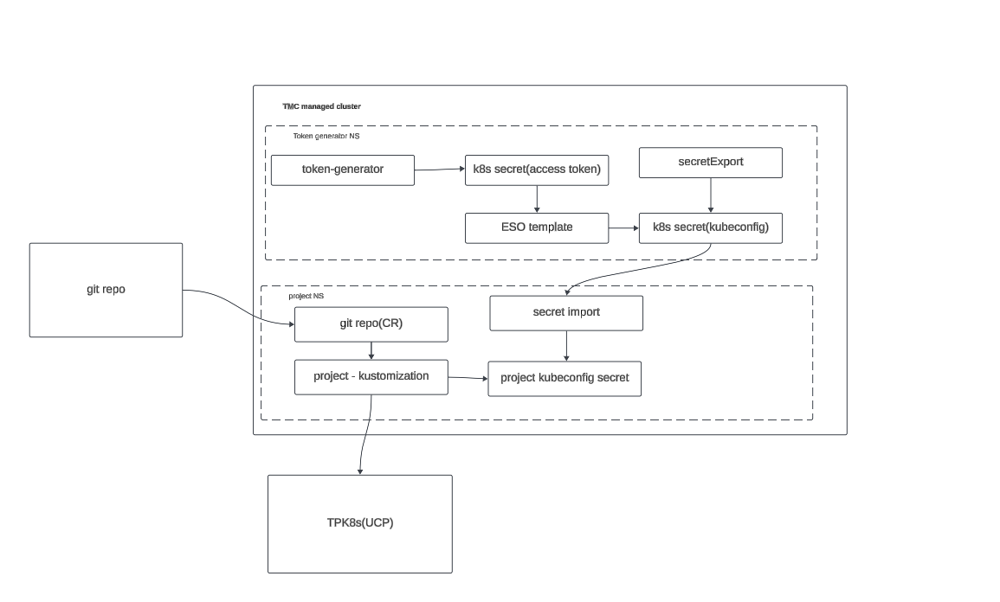

# Using Gitops to deploy to Tanzu Platform


## Flux/Argo Native way

Flux and Argo have the ability to specify a kubeconfig. The Tanzu platform kubeconfigs use the `exec` function to get a token since this token expires often the command it runs will generate a new one when needed. Each Gitops tool has different ways of handling this. 

To use this with flux two things are needed to be done. 

1. enable the flux kustomize [controller argument](https://fluxcd.io/flux/components/kustomize/options/) that allow `exec` to be run. `--insecure-kubeconfig-exec` . 
2. build a custom image for flux that has the cli tools you need to execute.

There is a security risk with enabling the exec functionality in flux. This also requires that you have full control over the flux install.

To use this with Argo, you would need to similarly create you own image.

1. [build your own image](https://argo-cd.readthedocs.io/en/stable/operator-manual/custom_tools/#byoi-build-your-own-image) with the tanzu cli embedded
2. [setup the config](https://argo-cd.readthedocs.io/en/stable/operator-manual/declarative-setup/#clusters) to run the tanzu commands 

## The other way

If you have a managed provider that installs your gitops controllers like Tanzu platform then you won't want to deal with hacking the above to work. This solutions uses the OOTB gitops controllers and some extra tools to handle connecting to the tanzu platform. It also does not require the `--insecure-kubeconfig-exec` flag for flux or creating your own images to embedd the tooling. There are multiple ways this could be implemented , this was was chosen in order to reduce custom work and re-use as much existing tooling as possible. 

### How it works

The token-generator deployment will handle creating a access token from the CSP token as well as continously renewing it before expiration. This token is placed into a secret and the ESO templating capability is used to then create a valid kubeconfig/cluster secret for the project in UCP. Then a secret export is used to make this available to other namespaces. a standard flux kustomization or argo app can then be created that then the imported kubeconfig/cluster secret to target the UCP api.

Flux:




ArgoCD:


## Sample Flux implementation

This example is not meant to show how to do end to end gitops with flux. This is setup in a very minimal so it can be easily understood.

Pre-reqs:
* TMC 
* TMC managed flux
* [externla-secrets](https://external-secrets.io/main/)


### Deploy the controller. 

This could easily be done by flux but for simplicity we are just deploying this via the command line.

1. create the secret needed for the controller. this should be your CSP token.

```bash
cat <<'EOF' >deploy/token-generator-deploy/generator.env
CSP_TOKEN=<your-token>
EOF
```

2. deploy the controller into the cluster you plan to use for gitops with flux. Ideally this is a cluster managed by TMC with flux enabled. 

```bash
kubectl apply -k deploy/token-generator-deploy              
```


### Create the kubeconfigs for UCP

We will be using external secrets operator to handle the kubeconfig creation and also secretgen controller to handle the distribution of the kubeconfigs to the correct namespaces. This could also easily be managed via flux but for simplicity we are just using the command line. Thsi example just sets up the project context but this could be done for space or cluster group the same way.

1. get the server url from the current context on the cli. this is used for our in cluster kubecofnig secret

```bash
#get the context url from your local cli

tanzu project use AMER-West
export KUBECONFIG=~/.config/tanzu/kube/config
kubectl config view --minify -o json | jq -r '.clusters[0].cluster.server'
```

2. Update the `deploy/secret-templates/project-context.yml` to use your server url.

3. create the secret store
   
```bash
kubectl apply -f deploy/secret-templates/secretstore.yml
```   
   
4. create secret export, and templated secret.

```bash
kubectl apply -f deploy/secret-templates/flux
```

### Deploy a space to TPK8s

Since the purpose of this is to deploy objects to UCP using gitops for this one we will be using flux for the deployment. 

1. create the flux kustomization and git repo to point to the sample repo and directory. This also imports the secret


```bash
k apply -f deploy/flux-resources
```


## Sample ArgoCD implementation

This example is not meant to show how to do end to end gitops with ArgoCD. This is setup in a very minimal so it can be easily understood.

Pre-reqs:
* ArgoCD installed
* [externla-secrets](https://external-secrets.io/main/)
* Carvel Secret Gen( if you are using TMC/TPK8S this is auto installed)


### Deploy the controller. 

This could easily be done by flux but for simplicity we are just deploying this via the command line.

1. create the secret needed for the controller. this should be your CSP token.

```bash
cat <<'EOF' >deploy/token-generator-deploy/generator.env
CSP_TOKEN=<your-token>
EOF
```

1. deploy the controller into the cluster you plan to use for gitops with ArgoCD.  

```bash
kubectl apply -k deploy/token-generator-deploy              
```

### Deploy the proxy workaround 

Becuase argoCD wants to validate many things in the k8s cluster we need to work around this for the time being. To do this we need to deploy a proxy that can spoof a request that ArgoCD requires. that request is for the version of the cluster. This proxy simple looks for the version api call and responds with a valid response

1. deploy the proxy

```bash
k apply -f deploy/mitmproxy
```

2. add the proxy settings to the `argocd-application-controller` statefulset. the noproxy settings below are the minimum needed. you may need more for your environment. You will want to add any hosts that are not TPk8s to this list.These settings should be able to be replaced once this [feature](https://github.com/argoproj/argo-cd/pull/9496) is implemented. How you add this is dependent on how you deploy argocd.

```yaml
env:
- name: HTTPS_PROXY
    value: mitmproxy.mitmproxy.svc.cluster.local:8080
- name: NO_PROXY
    value: argocd-repo-server,argocd-application-controller,argocd-metrics,argocd-server,argocd-server-metrics,argocd-redis,argocd-redis-ha-haproxy,argocd-dex-server,localhost,10.0.0.0/8
```

### Create resource exclusions for UCP

This is needed due to permissions and Argo wanting to sync and cache all resources in a cluster. 

1. add the following to the `argo-cm` configmap

```yaml
resource.exclusions: |
    - apiGroups:
        - "*"
        kinds:
        - "ResourceQuota"
        - "SelfSubjectAccessReview"
        - "SubjectAccessReview"
        - "SelfSubjectRulesReview"
        - "LocalSubjectAccessReview"
        clusters:
        - "https://api.tanzu.cloud.vmware.com/*"

```


### Create the ArgoCD cluster secrets for UCP

We will be using external secrets operator to handle the cluster secret creation and also secretgen controller to handle the distribution of the kubeconfigs to the correct namespaces. This could also easily be managed via ArgoCD but for simplicity we are just using the command line. This example just sets up the project context but this could be done for space or cluster group the same way.

1. get the server url from the current context on the cli. this is used for our in cluster kubecofnig secret

```bash
#get the context url from your local cli

tanzu project use AMER-West
export KUBECONFIG=~/.config/tanzu/kube/config
kubectl config view --minify -o json | jq -r '.clusters[0].cluster.server'
```

2. Update the `deploy/secret-templates/argo/project-context.yml` to use your server url.

3. create the secret store
   
```bash
kubectl apply -f deploy/secret-templates/secretstore.yml
```   
   
4.  create the secret export, and templated secret.

```bash
kubectl apply -f deploy/secret-templates/argo
```

### Deploy a space to TPK8s

Since the purpose of this is to deploy objects to UCP using gitops for this one we will be using ArgoCD for the deployment. 

1. create the argo app to point to the sample repo and directory.


```bash
k apply -f deploy/argo-resources
```

### Validate

at this point you should see a kustomization that is successfull and a new space created in your project.


## Building the token generator

this isn't necessary unless you are doing dev.

```bash
tanzu build config --containerapp-registry ghcr.io/{contact.team}/{name}
cd token-generator
tanzu build -r container-image
```